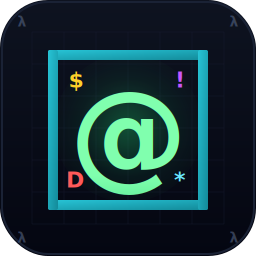
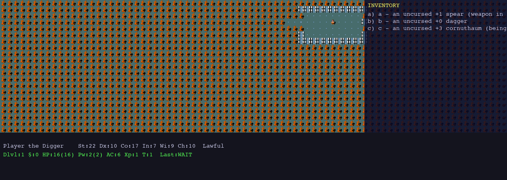

<p align="center">
  
</p>

<h1 align="center">Nethax</h1>

<p align="center">
  <strong>Pure-JAX NetHack 3.7 — JIT-compiled, vendor-bit-equal, full NLE drop-in.</strong>
</p>

<p align="center">
  
  
  
  
  
</p>

---

Nethax is a from-scratch reimplementation of [NetHack 3.7](https://github.com/NetHack/NetHack) — and the [NetHack Learning Environment (NLE)](https://github.com/facebookresearch/nle) — in pure functional JAX. The entire game state is a Flax pytree; every subsystem step is a `(state, action, rng) -> state` function with no Python control flow inside `jax.jit`; the same compiled artefact runs on CPU, GPU, or TPU.

The implementation is breadth-first to full vendor parity. Every formula carries a `vendor/nethack/src/<file>.c` citation, the 121-action set is byte-identical to `nle.nethack.ACTIONS`, the 17-key observation dict is byte-identical to `nle.nethack.OBSERVATION_DESC`, and the 5976-entry `glyph2tile` table matches NLE bit-for-bit.

## Why nethax?

- **Vendor-bit-equal.** Glyph table, action enum, blstats layout, observation dict, monster table (381 entries), object table (453 entries), spell list (43 formulas), and trap damage tables all match `vendor/nethack/` and `vendor/nle/` byte-for-byte. Deliberate simplifications (shopkeepers, bones) are listed in [`docs/vendor_parity.md`](docs/vendor_parity.md).
- **JIT-compiled hot path.** `env.step` is a single compiled XLA program — ~30–60 s one-time compile, ~1 ms per call after warmup, scales linearly under `jax.vmap`.
- **Batched at training scale.** `jax.vmap(env.step)` runs N independent rollouts as one fused kernel. `jax.lax.scan` removes Python-loop overhead for long trajectories. See [`docs/benchmark.md`](docs/benchmark.md).
- **NLE drop-in.** `Nethax.nethax.compat.nle_shim.NLECompat` matches the Gymnasium `(obs, info)` / `(obs, reward, terminated, truncated, info)` contract; existing NLE training scripts work with a one-line import swap.
- **Deeply tested.** 1691 unit + integration + property tests, 36 NLE-compat byte-equality checks, an opt-in 12-property deep Hypothesis sweep including a 500-step `RuleBasedStateMachine`.

## Quickstart

```python
import jax
import jax.numpy as jnp
from Nethax.nethax import NethaxEnv
from Nethax.nethax.constants.roles import Role
from Nethax.nethax.constants.races import Race

env = NethaxEnv()
state, obs = env.reset(jax.random.PRNGKey(0), role=Role.VALKYRIE, race=Race.HUMAN)

# Wait one turn.
state, obs, reward, done, info = env.step(
    state, jnp.int32(ord(".")), jax.random.PRNGKey(1),
)

# obs is the canonical 17-key NLE observation dict.
print(sorted(obs.keys()))
# ['blstats', 'chars', 'colors', 'glyphs', 'inv_glyphs', 'inv_letters',
#  'inv_oclasses', 'inv_strs', 'internal', 'message', 'misc',
#  'program_state', 'screen_descriptions', 'specials', 'tty_chars',
#  'tty_colors', 'tty_cursor']
```

NLE drop-in:

```python
from Nethax.nethax.compat.nle_shim import NLECompat as NLE

env = NLE(seed=0, character="val-hum-law-fem")
obs, info = env.reset()
obs, reward, terminated, truncated, info = env.step(0)  # vendor action index
```

## Interactive driver

```sh
python -m Nethax.ui.pygame_app
```

Arrow keys / `hjkl` / `yubn` for movement, `<` / `>` for stairs, `,` pickup, `e/q/r/z` consume, `a` apply, `i` inventory, `Q` quit.

<p align="center">
  
</p>

The same tile renderer that backs `python -m Nethax.ui.pygame_app` also produces the `obs["tty_chars"]` / `obs["tty_colors"]` arrays seen by an RL agent — both views are derived from the same `EnvState` pytree, so they cannot drift.

### Optional minimalist look

The Pygame driver ships the original NetHack sprites by default. A clean, dark-mode "nethax-native" tileset is also available — flip to it with one import:

```python
from Nethax.tiles.native_atlas import load_tiles_nethax
tiles = load_tiles_nethax()
```

Same dungeon, less 1990s.

## Tests

```sh
JAX_PLATFORMS=cpu .venv/bin/python -m pytest
```

**1691 tests collected**, all passing on CPU. Test surface includes:

- 36 NLE-compatibility tests (`tests/test_nle_compat_full.py`) — gymnasium API shape, observation byte-equality, action byte-equality, glyph2tile byte-equality, determinism sweeps.
- 87 total NLE-compat tests across `test_nle_compat.py`, `test_nle_observation.py`, `test_nle_integration.py`, `test_nle_compat_full.py`.
- Opt-in deep [Hypothesis](https://hypothesis.readthedocs.io/) property suite — set `RUN_HYPOTHESIS_FULL=1` to enable the full invariant sweep (`tests/test_hypothesis_full.py`).

## Documentation

| Doc | Purpose |
|---|---|
| [`docs/architecture.md`](docs/architecture.md) | Top-down system architecture, EnvState pytree shape, JAX functional contract |
| [`docs/vendor_parity.md`](docs/vendor_parity.md) | Per-subsystem vendor parity matrix with citations |
| [`docs/nle_migration.md`](docs/nle_migration.md) | NLE -> nethax migration guide for RL practitioners |
| [`docs/benchmark.md`](docs/benchmark.md) | Throughput numbers + JIT-compile cost vs NLE |
| [`docs/nle_compat.md`](docs/nle_compat.md) | NLE drop-in compatibility status (per-feature matrix) |
| [`CHANGELOG.md`](CHANGELOG.md) | Wave-by-wave history |

Per-wave development logs live under `docs/wave-{1..5}/`.

## Install

```sh
pip install -e .
```

Optional extras: `pip install -e .[test]` for pytest + hypothesis; `pip install -e .[scripts]` for the figure / video generators.

## Project layout

```
Nethax/
  nethax/
    constants/          NLE-parity enums, monster/object tables
    subsystems/         per-subsystem game logic (combat, magic, ...)
    dungeon/            level generation, branches, special levels, level memory
    obs/                observation builders (NLE dict, symbolic, pixel, text)
    compat/             NLE drop-in shim
    state.py            master EnvState pytree
    env.py              NethaxEnv (NLE-compatible API)
  minihax/              MiniHack-style curriculum on top of nethax
  ui/                   pygame interactive driver
  tiles/                sprite atlas + glyph -> tile mapping
docs/                   architecture + vendor parity + migration guides
tests/                  pytest suite (1691 tests)
vendor/                 canonical NetHack 3.7 / NLE / MiniHack clones (gitignored)
```

## Vendored canonical sources

The implementation is ported from the canonical C sources. Clone the references into `vendor/` (gitignored):

```sh
mkdir -p vendor
git clone --depth=1 https://github.com/NetHack/NetHack.git vendor/nethack
git clone --depth=1 https://github.com/facebookresearch/nle.git vendor/nle
git clone --depth=1 https://github.com/facebookresearch/minihack.git vendor/minihack
```

Target NetHack version: **3.7-branch** (the current HEAD line).

## License + acknowledgments

Nethax is released under the **MIT License** ([`LICENSE`](LICENSE)).

A small number of data tables and verbatim level-`MAP` strings are ported bit-for-bit from NetHack 3.7, which is distributed under the [NetHack General Public License (NGPL)](https://github.com/NetHack/NetHack/blob/master/dat/license). Downstream redistribution that includes those vendor-derived fragments may need to comply with NGPL terms; see [`docs/vendor_parity.md`](docs/vendor_parity.md) for a per-subsystem breakdown of what is reimplemented from scratch versus what is verbatim.

Acknowledgments:

- The [NetHack DevTeam](https://www.nethack.org/) for 30+ years of canonical NetHack source.
- [Facebook Research / NLE](https://github.com/facebookresearch/nle) for the canonical RL benchmark surface.
- [MiniHack](https://github.com/facebookresearch/minihack) for the curriculum-style env registry.
- The JAX, Flax, and Gymnasium projects.

## Citation

If you use Nethax in research, please cite both the original NetHack DevTeam and the NLE paper, alongside this implementation:

```bibtex
@software{nethax,
  title  = {Nethax: Pure-JAX NetHack 3.7},
  author = {The Nethax contributors},
  year   = {2026},
  url    = {https://github.com/}
}

@inproceedings{kuttler2020nethack,
  title     = {The NetHack Learning Environment},
  author    = {K{\"u}ttler, Heinrich and Nardelli, Nantas and Miller, Alexander H.
               and Raileanu, Roberta and Selvatici, Marco and Grefenstette, Edward
               and Rockt{\"a}schel, Tim},
  booktitle = {Advances in Neural Information Processing Systems (NeurIPS)},
  year      = {2020},
}
```
